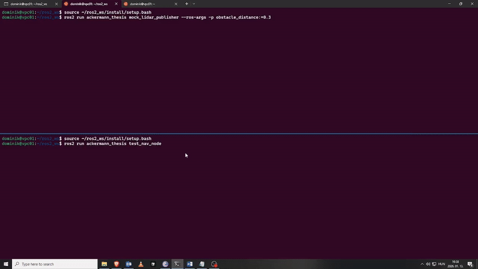

# Ackermann Navigation Thesis

ROS 2 navigation system for Ackermann steering robot - Thesis testing/studying project by Gaál Dominik.

## Demo

<!-- Add your demo GIF/video here -->


*Demo showing the navigation node processing mock LiDAR data*

## Overview

This repository contains a test program and foundation for developing an autonomous navigation system for a Wheeltec Ackermann-steering robot using ROS 2 Humble. 

**Current Implementation (First Semester):**
- Basic sensor integration (LiDAR data subscription)
- Simple local occupancy grid ("board model")
- Basic obstacle avoidance algorithm
- Control command publishing (Twist messages)
- Mock LiDAR publisher for testing without simulator

**Future Goals:**
- Advanced path planning algorithms (Hybrid A*, TEB, etc.)
- Full state estimation and odometry integration
- Complete Ackermann-compatible motion control
- Integration with Gazebo simulator and real robot

## Repository Structure

```
ackermann_nav_thesis/
├── ackermann_thesis/          # ROS 2 package
│   ├── ackermann_thesis/      # Python source code
│   ├── launch/                # Launch files
│   ├── package.xml
│   └── setup.py
└── README.md
```

## Dependencies

### System Requirements
- Ubuntu 22.04 (Jammy Jellyfish) or compatible Linux distribution
- ROS 2 Humble Hawksbill installed and sourced

### Required ROS 2 Packages

These packages are typically included with ROS 2 Humble, but ensure they are installed:

```bash
sudo apt install \
    ros-humble-sensor-msgs \
    ros-humble-geometry-msgs \
    ros-humble-std-msgs \
    ros-humble-visualization-msgs \
    ros-humble-tf2-ros \
    ros-humble-tf2-geometry-msgs \
    ros-humble-rviz2
```

### Python Dependencies

```bash
sudo apt install python3-numpy
# Or via pip:
# pip3 install numpy
```

### Optional Dependencies (for Simulator)

For using the minimal simulator launch file:
```bash
sudo apt install ros-humble-ros-gz-sim ros-humble-ros-gz-bridge
```

### External Repositories (Optional)

- **Robot Model**: [`megoldas_sim24`](https://github.com/robotverseny/megoldas_sim24) - Wheeltec Ackermann robot model (used as reference, not modified)
- **Simulator**: [`robotverseny_gazebo24`](https://github.com/robotverseny/robotverseny_gazebo24) - Gazebo simulation environment (optional, for full simulation)

## Setup Instructions

### 1. Install Required Packages

First, install all required ROS 2 packages and dependencies:

```bash
# Install ROS 2 packages
sudo apt update
sudo apt install \
    ros-humble-sensor-msgs \
    ros-humble-geometry-msgs \
    ros-humble-std-msgs \
    ros-humble-visualization-msgs \
    ros-humble-tf2-ros \
    ros-humble-tf2-geometry-msgs \
    ros-humble-rviz2 \
    python3-numpy

# Optional: For simulator support
sudo apt install ros-humble-ros-gz-sim ros-humble-ros-gz-bridge
```

### 2. Clone Dependencies

```bash
cd ~/ros2_ws/src

# Clone robot model (required for simulator, optional for mock testing)
git clone https://github.com/robotverseny/megoldas_sim24.git

# Optional - For Full Simulator:
git clone https://github.com/robotverseny/robotverseny_gazebo24.git
```

### 3. Build the Workspace

```bash
cd ~/ros2_ws

# Source ROS 2 (if not already in your .bashrc)
source /opt/ros/humble/setup.bash

# Build the workspace
colcon build --symlink-install

# Source the workspace
source install/setup.bash
```

**Note:** Add `source ~/ros2_ws/install/setup.bash` to your `~/.bashrc` for convenience.

### 4. Run the Simulator (Optional)

**Option A: Use the minimal simulator (Recommended)**
```bash
# Build robotverseny_description first (if not already built)
cd ~/ros2_ws
colcon build --packages-select robotverseny_description --symlink-install
source install/setup.bash

# Start the minimal simulator
ros2 launch ackermann_thesis minimal_sim.launch.py rviz:=true

# If you get OGRE rendering errors (common in WSL), you can try:
# - Make sure you have X11 forwarding set up
# - Or use a different display method
# - The bridge should still work even if Gazebo GUI fails
```

**Option B: Use the full robotverseny_gazebo24 simulator**
```bash
# If you have robotverseny_gazebo24 fully built
ros2 launch robotverseny_bringup roboworks.launch.py rviz:=true
```

**Note:** The test navigation node requires:
- `/scan` topic (LaserScan messages)
- TF transforms between `odom_combined`, `base_link`, and `laser` frames
- The simulator should be running before starting the navigation node

### 5. Run Navigation Nodes

**Option A: With Mock LiDAR (Recommended for Testing in WSL)**

If Gazebo has rendering issues, use the mock LiDAR publisher:

```bash
# Terminal 1: Start mock LiDAR publisher
source ~/ros2_ws/install/setup.bash
ros2 run ackermann_thesis mock_lidar_publisher

# Terminal 2: Run your navigation node
source ~/ros2_ws/install/setup.bash
ros2 run ackermann_thesis test_nav_node
```

The mock publisher creates:
- `/scan` topic with fake obstacle data
- TF transforms (`odom_combined` -> `base_link` -> `laser`)

**Option B: With Simulator**

```bash
# Terminal 1: Start simulator
source ~/ros2_ws/install/setup.bash
ros2 launch ackermann_thesis minimal_sim.launch.py rviz:=true

# Terminal 2: Run navigation node
source ~/ros2_ws/install/setup.bash
ros2 run ackermann_thesis test_nav_node
```

**Option C: Using Launch File**

```bash
# After simulator/mock publisher is running
source ~/ros2_ws/install/setup.bash
ros2 launch ackermann_thesis test_nav.launch.py
```

## Architecture

The current test program implements a simplified architecture with the following components:

1. **Sensor Integration**: Subscribes to LiDAR data (`/scan` topic)
2. **Board Model**: Maintains a local 2D occupancy grid for obstacle representation
3. **Obstacle Detection**: Simple forward-path checking algorithm
4. **Basic Control**: Publishes velocity commands (`/cmd_vel`) based on obstacle detection

**Planned Architecture (Future Development):**
- Full sensor fusion (LiDAR, odometry, IMU)
- Advanced path planning (Hybrid A*, TEB, etc.)
- Complete Ackermann kinematics controller
- Dynamic obstacle handling

## Development Status

- [x] Repository setup
- [x] ROS 2 package structure
- [x] Sensor integration (LiDAR subscription)
- [x] Board model (local occupancy grid)
- [x] Base navigation algorithm (simple obstacle avoidance)
- [x] Ackermann controller (Twist command publishing)
- [x] Mock LiDAR publisher for testing
- [x] Basic testing and validation
- [ ] Advanced path planning algorithms (Hybrid A*, etc.)
- [ ] Full simulator integration
- [ ] Real robot testing

## License

[To be determined]

## Author

Gaál Dominik - Mérnökinformatikus BSc
